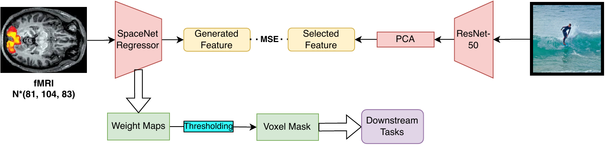
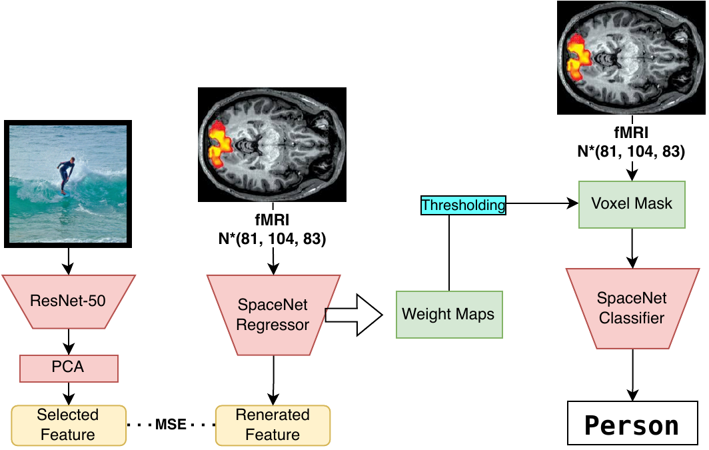
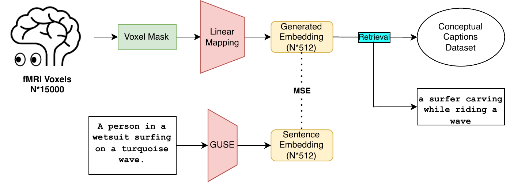

# Neural Interpretation Framework: ML in Neuroimaging
Our study introduces a novel approach to understanding visual perception through brain activity analysis, leveraging the Natural Scenes Dataset (NSD). We employ the ResNet-50 model for extracting detailed visual features from images and use Principal Component Analysis (PCA) for feature refinement. Our unique method involves training the SpaceNet Regressor on these features to create specific brain maps, identifying key brain regions involved in visual processing. We validate our approach with two tasks: image classification and text-based regression analysis. The image classification task assesses the effectiveness of our voxel selection, while the text-based regression analysis examines the ability of our model to capture semantic content from brain activity. Results show our method outperforms traditional techniques in accuracy and detail, offering new insights into brain function and potential advancements in brain-computer interfaces and neuroscientific research.\
## General Pipeline:

## Dataset
We are using Natural Scene Dataset (NSD) here:
- NSD data manual: [Here](https://cvnlab.slite.page/p/CT9Fwl4_hc/NSD-Data-Manual)

## Results on Downstream Tasks
### 1. Image Classification

The Image Classification task, as depicted in figure above, is designed to evaluate the effectiveness of voxel selection by applying varying thresholds to weight maps derived from fMRI data.

### 2. Text Based Regression

The figure presents a step-by-step workflow, starting from the initial fMRI voxel data and culminating in the retrieval of corresponding textual captions. This process encompasses linear mapping to generate embeddings, the application of the Google Universal Sentence Encoder (GUSE), and the final selection of captions from the Conceptual Captions Dataset.
